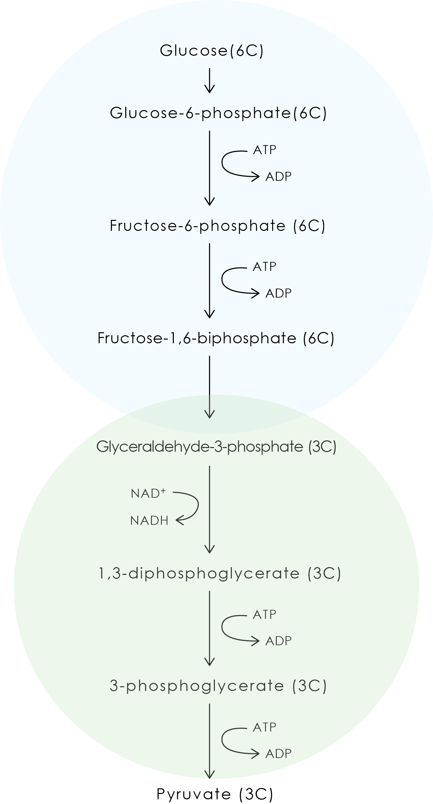
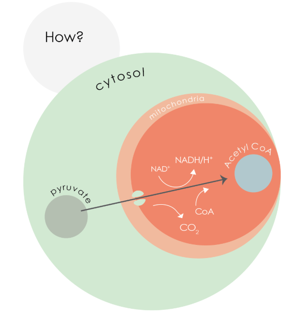
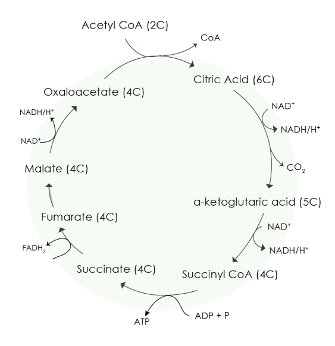
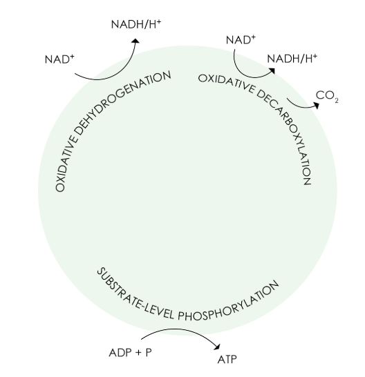
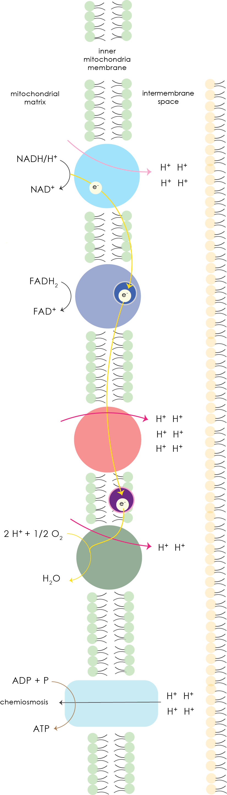

## Learning Outcomes

1. List and give an overview of the four stages of **aerobic respiration** and indicate **where each stage takes place** in the eukaryotic cell and mitochondria, and **add up the energy captured** (as ATP, reduced NAD and FAD) in each stage
2. Explain the production of a small yield of ATP from **anaerobic respiration** and the formation of ethanol in yeast and lactate in mammals.

## Aerobic Respiration

### Glycolysis

#### Definition

- Glycolysis is the sequence of reactions that breaks down **glucose** to **pyruvate** with simultaneous trapping of energy released as **ATP**, accompanied by the formation of **NADH/H+**.

| Property         | Value                           |
| ---------------- | ------------------------------- |
| Location         | Cytosol                         |
| Inputs per turn  | 1x Glucose, 2x ATP, 2x NAD+     |
| Outputs per turn | 2x Pyruvate, 4x ATP, 2x NADH/H+ |
| Net ATP Gain     | 2x ATP                          |

#### Process

{: style="width:400px"}

### Link Reaction

| Property           | Value                                         |
| ------------------ | --------------------------------------------- |
| Location           | Mitochondrial Matrix                          |
| Inputs per turn    | 1x Pyruvate, 1x NAD+                          |
| Outputs per turn   | 1x Acetyl CoA, 1x CO2 , 1x NADH/H+ |
| Ouputs per glucose | 2x Acetyl CoA, 2x CO2 , 2x NADH/H+ |

#### Process

{: style="width:400px"}

### Krebs Cycle

| Property           | Value                                                                 |
| ------------------ | --------------------------------------------------------------------- |
| Location           | Mitochondrial Matrix                                                  |
| Inputs per turn    | 1x Acetyl CoA, 3x NAD+, 1x ADP, 1x P, 1x FAD, Krebs Cycle Enzymes     |
| Outputs per turn   | 2x CO2, 1x ATP, 3x NADH/H+, 1x FADH2 |
| Ouputs per glucose | 4x CO2, 2x ATP, 6x NADH/H+, 2x FADH2 |

#### Process

{: style="width:400px"}
{: style="width:400px"}

### Oxidative Phosphorylation

#### Definition

- Oxidative phosphorylation is the process by which ATP is formed as electrons are transferred from NADH/H+ or FADH2 to oxygen via a series of electron carriers.

#### Process

{: style="width:400px"}

##### Source of protons (H+)

- Reduction of NAD+ to NADH/H+ in glycolysis, link reaction and Krebs cycle. 
- Reduction of FADH2 in Krebs cycle.

##### Details

1. **High energy electrons** from NADH/H+ and FADH2 are passed along a chain of electron carriers _(electron transport chain)_, releasing energy in a series of small steps as the electrons are passed down from **high** to **low energy carriers**.

2. _Oxygen acts as the final electron acceptor. It is reduced to form metabolic water._

3. **Free energy** released is used to **pump protons** from the mitochondrial matrix across the inner mitochondrial membrane into the inter-membrane space **against the concentration gradient.**

4. As inner-mitochondrial membrane is **impermeable to ions**, a **proton gradient** is created across the inner mitochondrial membrane.

5. Protons move back from the inter-membrane space through the **ATP synthase complex** into the mitochondrial matrix, down the **proton gradient**.

6. The ATP synthase complex uses the **exergonic flow of protons** to drive the **phosphorylation** of **ADP** to form **ATP**.

## Anaerobic Respiration

### Alcholic Fermentation

| Property  | Value          |
| --------- | -------------- |
| Occurence | Plants, Yeasts |

!!! Equation
    Glucose (6C) --> 2 Ethanol (2C) + 2 CO^2^
    
    *A lot of energy remains trapped in in ethanol.*

#### Outcome

- Plants can respire anaerobically only for short periods of time since ethanol is toxic.
- In yeast, ethanol produced may accumulate in the medium until its concentration rises to a level that kills the yeast.

### Lactate Fermentation

| Property  | Value          |
| --------- | -------------- |
| Occurence | Muscles of Animals |

!!! Equation
    Pyruvate (3C) + NADH/H^+^ --> Lactate (2C) + NAD^+^
    
    *A lot of energy remains trapped in in lactate too.*

### Outcome

* Lactate is transported to the liver and converted back to pyruvate.

    * Pyruvate is converted to acetyl CoA, which enter the Krebs Cycle OR
    * Pyruvate is converted to glucose, then to glycogen and stored in the liver or muscles

!!! Contributors
    
    - Ri Zhao

    [Contribute & get yourself recognise here 👈](https://docs.google.com/document/d/1Xqj0DNKCBy42yQn9nCgBW75MhIC95GzzeWNE1oD7g1c/edit?usp=sharing)